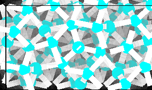

    genice2 4R -f png[shadow:rotatex=2:rotatey=88] > 4R.png


# [{{package}}]({{url}})

A {{genice}} plugin to illustrate the structure in SVG (and PNG) format.

version {{version}}

## Requirements


* {{i}}


## Installation from PyPI

```shell
% pip install {{package}}
```

## Manual Installation

### System-wide installation

```shell
% make install
```

### Private installation

Copy the files in {{base}}/formats/ into your local formats/ folder.

## Usage


    {{usage_svg}}


Png is a quick alternative for svg. Use png if making svg is too slow.


    {{usage_png}}


## Test in place

```shell
% make test
```
